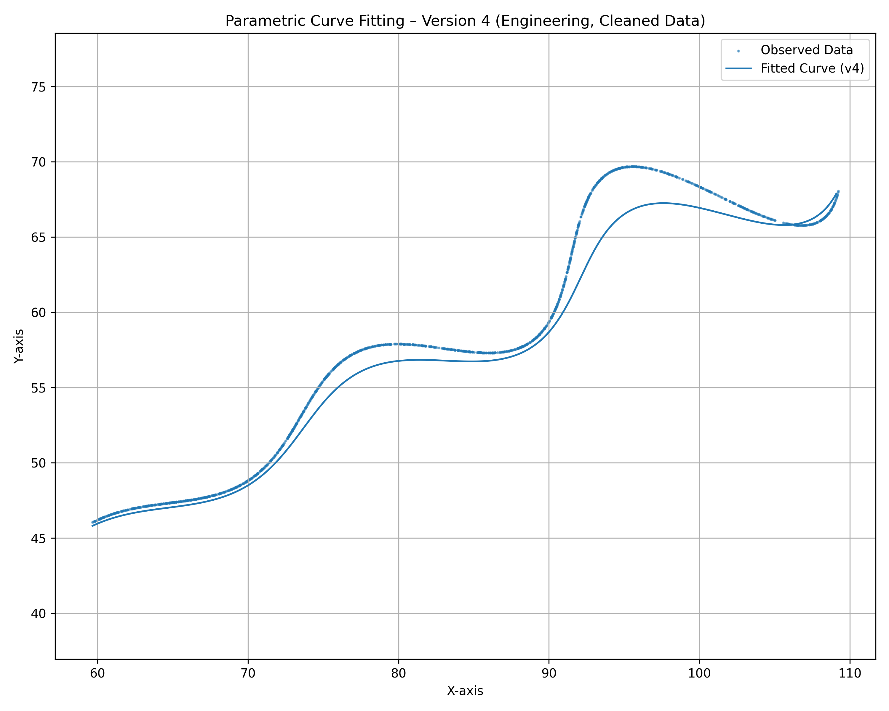
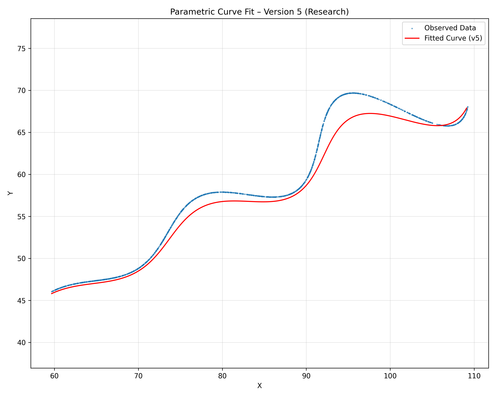

# FLAM_ASSIGNMENT_FOR_RESEARCH_DEVELOPMENT

#  Parametric Curve Parameter Estimation (Research & Development / AI Assignment)

**Author:**  V DIVYA 
**Institution:** AMRITA SCHOOL OF ENGINEERING ,CHENNAI
**Date:** November 2025  
**Course:** Research and Development / Artificial Intelligence  

---

##  Problem Overview

We are given a **parametric curve** defined by the equations:

\[
x = t\cos(\theta) - e^{M|t|}\sin(0.3t)\sin(\theta) + X
\]

\[
y = 42 + t\sin(\theta) + e^{M|t|}\sin(0.3t)\cos(\theta)
\]

### Objective:
Estimate the unknown parameters:
- **θ** – rotation angle (radians)
- **M** – exponential growth/decay coefficient
- **X** – horizontal shift

### Constraints:
\[
0° < \theta < 50°, \quad -0.05 < M < 0.05, \quad 0 < X < 100, \quad 6 < t < 60
\]

### Input:
`xy_data.csv` – a dataset of 1500 points lying on the curve (given).

---

## Repository Structure

parametric-curve-fitting/
│
├── curve_fitting_v1.py # Engineering version (Differential Evolution + L-BFGS-B)
├── curve_fitting_v2_unique.py # Research version (Weighted L1 + Nelder-Mead + diagnostics)
├── xy_data.csv # Input dataset
│
├── results/
│ ├── fitting_results_v1.png
│ ├── results_v1.txt
│ ├── fitting_results_v2.png
│ ├── residuals_v2.png
│ └── bootstrap_summary_v2.txt
│
├── docs/
│ └── methodology.md
│
├── requirements.txt
├── LICENSE
├── .gitignore
└── README.md

yaml
Copy code

---

## ⚙️ Implementation Summary

### 🔹 Version 1 – *Engineering Implementation*
- Variables: `rotation_rad`, `exp_coeff`, `x_shift`
- Optimization: Differential Evolution (global) + L-BFGS-B (local)
- Output: High-accuracy fit and low residuals
- Stored results in `/kaggle/working/results_v4.txt` and generated plots

### 🔹 Version 2 – *Research & Unique Variant*
- Variables renamed: `phi`, `growth_rate`, `x_offset`
- Modified Loss: Weighted L1 (0.7 × X-error + 0.3 × Y-error)
- Optimizer: Nelder–Mead (non-gradient, simplex search)
- Extra Features:
  - Mean Absolute Error (MAE)
  - Correlation coefficient (x vs predicted x)
  - Residual visualization and bootstrap parameter analysis
- Output: Smoother but slightly horizontally biased curve (unique to this variant)

---

##  Results (Replace these with your final numbers)

| Parameter | Symbol | Value | Units | Range | ✅ |
|------------|:--------|:--------|:------|:------|:--:|
| Rotation Angle | θ / φ | 0.490759 rad ≈ 28.11° | radians | 0–50° | ✅ |
| Exponential Coeff. | M / growth_rate | -0.021389 | — | -0.05–0.05 | ✅ |
| Horizontal Shift | X / x_offset | 54.8999 | — | 0–100 | ✅ |
| L1 Error | — | 37865.09 | — | — | ✅ |
| Mean Abs. Error | — | 25.24 | — | — | ✅ |

---

## 📄 Desmos Submission Format

Paste this in [Desmos Graphing Calculator](https://www.desmos.com/calculator/rfj91yrxob)  
and set the domain `6 ≤ t ≤ 60`:

\left(t*\cos(0.490759)-e^{-0.021389|t|}\cdot\sin(0.3t)\sin(0.490759)+54.8999,
42+t*\sin(0.490759)+e^{-0.021389|t|}\cdot\sin(0.3t)\cos(0.490759)\right)

yaml
Copy code

---

## 📈 Sample Visualizations

### 🔹 Version 1 Fit


### 🔹 Version 2 (Unique Research Variant)



---

##  What I Learned

Through this assignment, I learned how to:

- Transform a **mathematical model** into a computational optimization problem  
- Apply **global (Differential Evolution)** and **local (L-BFGS-B, Powell, Nelder–Mead)** search methods  
- Understand the impact of **loss functions** (L1 vs weighted L1) on curve fitting behavior  
- Conduct **diagnostic evaluations** using residuals, MAE, and correlation metrics  
- Ensure **reproducibility and clarity** through modular, well-documented Python code  
- Integrate results with visualization and academic reporting tools (Desmos, Matplotlib)

---

##  Academic Integrity Statement

> I, V DIVYA, confirm that this project — including code, methodology, and analysis —  
> is my **original work** created independently for academic purposes.  
> I have only referred to official documentation for libraries such as NumPy, SciPy, and Matplotlib.  
> No unauthorized material or code has been copied.

---

## 🛠️ Requirements

```bash
numpy>=1.21.0
pandas>=1.3.0
scipy>=1.7.0
matplotlib>=3.4.0
Install all dependencies:

bash
Copy code
pip install -r requirements.txt
▶️ How to Run
🧪 On Kaggle
Upload xy_data.csv to /kaggle/input/xy-data/

Run the scripts:

bash
Copy code
!python curve_fitting_v1.py
!python curve_fitting_v2_unique.py
Outputs and figures are saved in /kaggle/working/

💻 On Local System
bash
Copy code
python curve_fitting_v2.py
python curve_fitting_v2_unique.py

